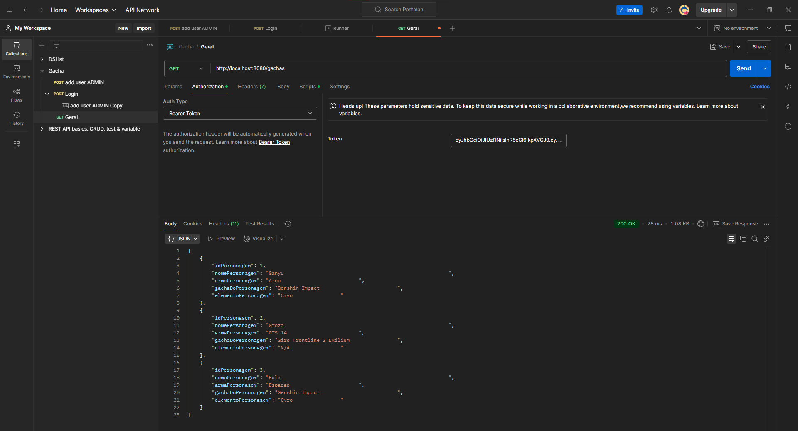
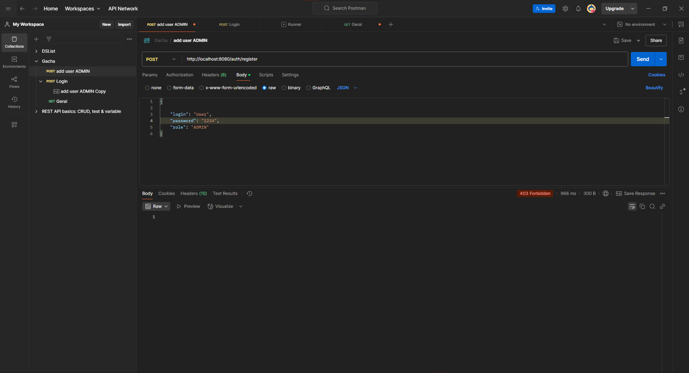
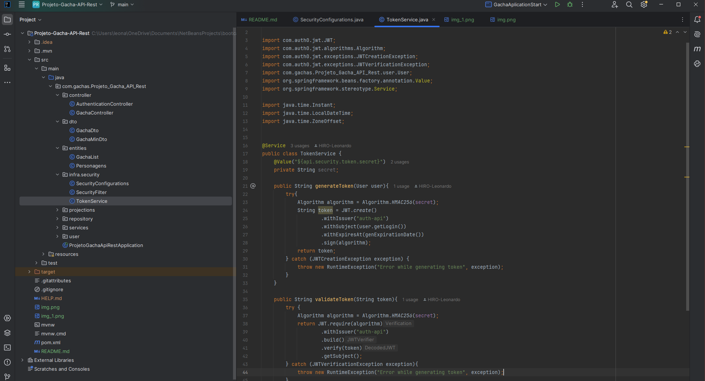

<h1>Projeto sobre personagens de varios gachas. </h1>
<h3>Tecnologias usadas:</h3>

 
<h3>Sobre o projeto:</h3>
 
Criado em Java com Spring Boot, este programa inovador 
certamente irá atrair os consumidores através de personagens
populares de jogos criados de acordo com os arquivos de dados
completos, isto é, com a ajuda de datasets. A API RESTful com 
técnicas GET e POST ajuda a criar interatividade e dinamismo. 
Além disso, foi dada prioridade à segurança, sendo implementadas 
técnicas autenticação/autorização. O Spring Security foi usado para
criar robust authentication/ authorization, e os tokens JWT, bem como 
os perfis de usuário – ADMIN e USER – permitirão o access saudável e a 
proteção dos dados.

 
<h2>Screenshots:</h2>

 
<h4>Ainda em desenvolvimento!!</h4>

